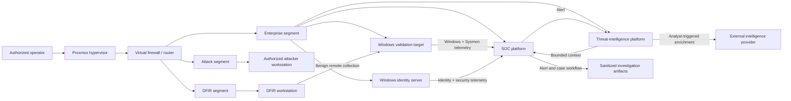

# Mayuri Purple-Team Lab

A **sanitized, evidence-backed reference architecture** for a segmented Proxmox purple-team lab supporting Windows identity, adversary simulation, SOC monitoring, DFIR collection, detection validation, and threat-intelligence enrichment.

This repository documents the lab without publishing exact addresses, MACs, internal DNS names, credentials, tokens, firewall rules, or raw evidence.

## Explore

- [Architecture](docs/ARCHITECTURE.md)
- [Asset inventory](docs/ASSET_INVENTORY.md)
- [Network segmentation](docs/NETWORK_SEGMENTATION.md)
- [Telemetry pipeline](docs/TELEMETRY_PIPELINE.md)
- [Purple-team workflow](docs/PURPLE_TEAM_WORKFLOW.md)
- [DFIR workflow](docs/DFIR_WORKFLOW.md)
- [Threat intelligence](docs/THREAT_INTELLIGENCE.md)
- [Validation matrix](docs/VALIDATION_MATRIX.md)
- [Recovery model](docs/RECOVERY_AND_SNAPSHOTS.md)
- [Sanitization policy](docs/SANITIZATION_POLICY.md)
- [Known limitations](docs/KNOWN_LIMITATIONS.md)

## Current verified state

| Capability | Status | Public-safe proof |
|---|---|---|
| Segmented virtualization | **Verified** | Separate management, enterprise, attack, and DFIR bridges behind a virtual firewall |
| Windows identity | **Verified** | AD DS, DNS, and Netlogon active; domain member secure channel healthy |
| Endpoint telemetry | **Verified** | Sysmon, Wazuh, Splunk forwarder, PowerShell logging, and Velociraptor agents active on the Windows target |
| SOC platform | **Verified** | Wazuh manager/indexer/dashboard, Suricata, and Splunk processes active |
| Attacker workstation | **Verified** | Kali with scoped AD and network assessment tooling plus Atomic Operator |
| DFIR workstation | **Partially verified** | Core analysis workspace and tools staged; revalidate all services before each exercise |
| Automated alert intake | **Live validated** | Benign PowerShell replay produced a deduplicated investigation case through Splunk and orchestration |
| CTI enrichment | **Live validated** | OpenCTI and the official Shodan connector completed a benign IPv4 enrichment with zero errors |
| SIEM alert enrichment | **Live validated** | Wazuh and Splunk alerts received bounded, cached OpenCTI/Shodan context without making CTI authoritative |
| Recovery checkpoints | **Verified** | Milestone snapshots exist across infrastructure, identity, endpoint, SOC, attacker, DFIR, and CTI roles |

## Architecture

## Validation lifecycle

1. define an authorized scope and expected telemetry;
2. verify identity, DNS, time, storage, and collection prerequisites;
3. create a rollback checkpoint;
4. execute one low-impact behavior on the designated target;
5. confirm native logs and sensor telemetry;
6. verify SIEM detection and case routing;
7. collect supporting evidence with DFIR tooling;
8. clean up the simulated behavior;
9. publish only sanitized results and limitations.

## Repository map

| Path | Purpose |
|---|---|
| `docs/` | Architecture, operating model, validation, recovery, and limitations |
| `evidence/` | Text-only sanitized validation summaries; never raw evidence |
| `config/` | Abstract example inventory with no live values |
| `automation/` | Credential-free reference broker, relay, Wazuh integration, systemd unit, and examples |
| `tests/` | Unit coverage for filtering, caching, fail-open behavior, summaries, and credential precedence |
| `scripts/` | Public-safety and Markdown-link checks |
| `.github/workflows/` | CI enforcement for documentation safety |

## Safety boundaries

- Testing is limited to explicitly authorized lab assets.
- The attack segment is not a general-purpose offensive platform.
- No production, home, or internet target is in scope.
- Destructive containment and attack actions require explicit approval.
- Domain controller changes are staged separately from SOC changes.
- Credentials and live infrastructure configuration remain outside this repository.
- Raw EVTX, PCAP, memory images, malware, and sensitive logs are never committed.

## Evidence highlights

- [PowerShell detection-to-case validation](evidence/powershell-detection-to-case.md)
- [OpenCTI and Shodan enrichment validation](evidence/opencti-shodan-enrichment.md)
- [Wazuh and Splunk alert-enrichment validation](evidence/alert-cti-enrichment.md)
- [Velociraptor collection validation](evidence/velociraptor-collection.md)

## What this demonstrates

- segmented lab architecture and change control;
- Windows AD, logging, and endpoint telemetry administration;
- SIEM engineering with Wazuh, Splunk, Sysmon, and Suricata;
- controlled purple-team validation with cleanup gates;
- DFIR collection and evidence-handling discipline;
- CTI enrichment with OpenCTI and Shodan;
- automation that converts validated detections into investigation artifacts;
- public-safe documentation and CI-enforced sanitization.

## Limitations

This is a lab reference, not a production architecture or deployment repository. Exact network policy, credentials, live configuration, and raw evidence are intentionally excluded. See [Known limitations](docs/KNOWN_LIMITATIONS.md).

## License

Documentation and example configuration are released under the [MIT License](LICENSE).
