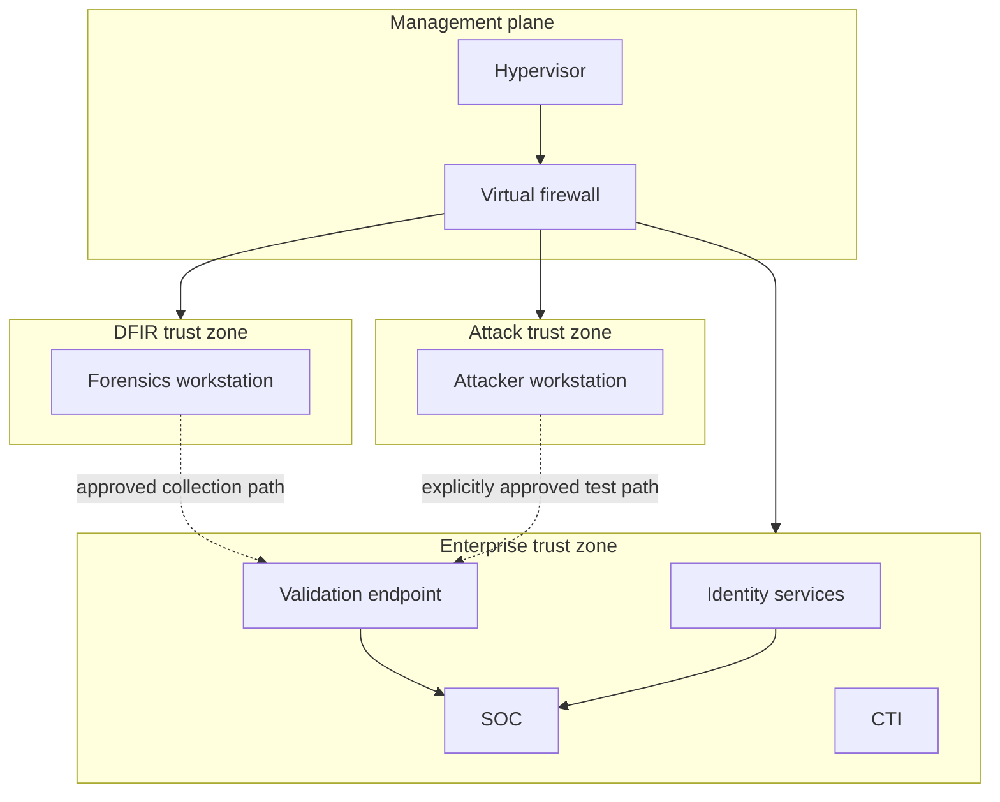

# Architecture

## Design goals

The lab separates identity/endpoint systems, authorized attack tooling, and DFIR processing while retaining controlled telemetry and administration paths. A virtual firewall owns inter-segment routing and policy.

## Logical planes

| Plane | Responsibilities | Representative components |
|---|---|---|
| Virtualization | Compute, storage, snapshots, guest agents | Proxmox VE |
| Control | Routing, NAT, DHCP policy, inter-segment controls | OPNsense |
| Identity | Directory, DNS, policy, authentication | Windows Server AD DS |
| Endpoint | Controlled Windows behavior validation | Windows workstation, Defender, Sysmon |
| Detection | Collection, search, correlation, alerting | Wazuh, Splunk, Suricata |
| Attack simulation | Approved, scoped test execution | Kali, Atomic Red Team tooling |
| DFIR | Remote collection and offline analysis | Velociraptor, YARA, timeline/packet tools |
| Threat intelligence | Structured intelligence and enrichment | OpenCTI, official Shodan connector |
| Orchestration | Alert normalization and case creation | Webhook workflow and authenticated receiver |

## Trust boundaries

## Architectural principles

- **Default separation:** role-specific bridges prevent accidental flat-network behavior.
- **Victim-first execution:** endpoint behavior is generated on the intended Windows target, not sprayed from Kali.
- **Collection before complexity:** native logs and endpoint sensors are proven before orchestration is added.
- **One major plane at a time:** identity, telemetry, attack tooling, and DFIR changes have separate gates.
- **Recoverability:** snapshots precede major changes; stateful services also require export/backup plans.
- **Public-safe evidence:** published artifacts preserve engineering proof without reproducing live topology.
