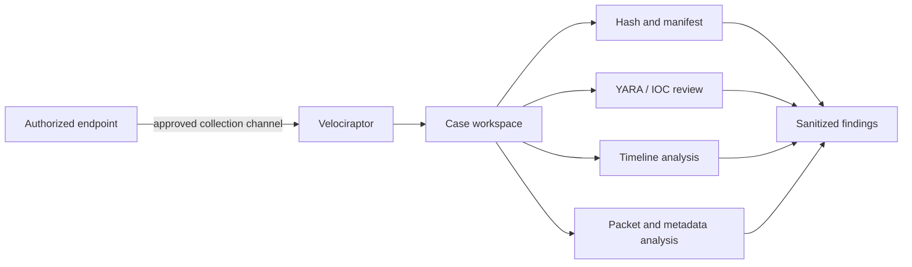

# DFIR workflow

## Purpose

The DFIR zone supports controlled remote collection and offline analysis without turning the SOC server into a general evidence workstation.

## Collection model

## Evidence-handling rules

- acquire to a case-specific workspace;
- record source, time, collector, and hash;
- mount evidence read-only where practical;
- preserve raw evidence outside Git;
- commit only sanitized summaries and manifests;
- distinguish observations from analyst inference;
- verify cleanup of temporary collections and credentials.

## Validated capability

A benign remote collection against the designated Windows endpoint was completed through Velociraptor during deployment validation, and returned endpoint metadata was checked against the intended target.

## Current gate

The DFIR workstation is documented as **partially verified** until its complete service/tool set is rechecked immediately before the next exercise. Historical deployment proof does not replace a fresh preflight.

## Recommended next DFIR exercise

Collect a harmless Windows triage package, build a short timeline, verify hashes, run YARA against a known-safe sample directory, and publish a sanitized findings summary with no raw artifacts.
