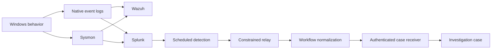

# Telemetry and case pipeline

## Sources

- Windows Security and System logs
- PowerShell Operational logging
- Sysmon Operational logging
- Microsoft Defender Operational logging
- Task Scheduler and WMI Activity logs where applicable
- Active Directory and DNS service telemetry
- Wazuh agent telemetry
- Splunk universal forwarder events
- Suricata network events
- Velociraptor collection results

## Detection path

## Validated boundary

A controlled PowerShell behavior generated a fresh endpoint event. Splunk matched the detection, fired a webhook through a constrained relay, the orchestration workflow normalized it, and the authenticated receiver created a high-severity investigation case. A subsequent scheduled run suppressed the duplicate.

## Design controls

- only expected sources may call the relay;
- webhook and receiver tokens remain outside source control;
- malformed payloads fail closed;
- case output is deterministic and traceable to detection/scenario identifiers;
- deduplication prevents repeated scheduled searches from flooding cases;
- external chat notifications are secondary delivery, not the system of record.

## Current limitations

- Some Splunk field handling still relies on raw Windows XML rather than complete CIM normalization.
- Wazuh and Splunk serve complementary learning/validation roles rather than a single production SIEM design.
- Public evidence is summarized; raw event records remain private.
