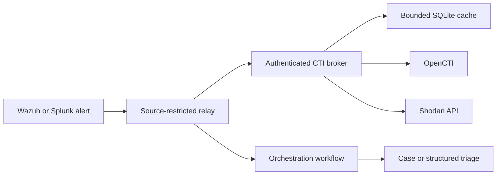

# Threat-intelligence enrichment

## Platform

The CTI role uses OpenCTI Community with one worker and the official Shodan internal-enrichment connector. Search, object storage, queue, and cache dependencies remain private to the container network; only the application interface is published to the isolated lab segment.

## Security posture

- platform and connector images are version-pinned;
- runtime secrets are root-owned and excluded from Git;
- the external API key is injected through a protected runtime path;
- automatic enrichment is disabled to control noise and API consumption;
- telemetry is disabled;
- backend database/queue ports are not published;
- application and connector persistence are tested across reboot.

## Validated enrichment

A benign public IPv4 observable was created through the supported OpenCTI client. The Shodan connector acknowledged the request, submitted a STIX bundle, and completed the work with zero connector errors. The observable and connector registration persisted across a guest reboot.

## Alert enrichment path

Wazuh and Splunk alerts can use a separate, authenticated enrichment broker before orchestration. The broker accepts the original alert, extracts a bounded set of eligible public IPv4 observables, and attaches cached OpenCTI and Shodan context.

Security and reliability controls include:

- bearer authentication and source-address restrictions;
- runtime credentials supplied through systemd credential files;
- public IPv4 validation, normalization, deduplication, and per-alert caps;
- finite, range-checked provider timeouts and request limits;
- automatic HTTP redirects disabled for authenticated provider and relay requests;
- provider JSON responses capped at 512 KiB and relay responses capped at 1 MiB;
- IPv4 source checks before handler dispatch, bounded concurrent request workers, finite inactivity timeouts, and absolute connection deadlines;
- a 64 KiB cache-entry cap, 10,000-row ceiling, and 64 MiB physical SQLite ceiling across the database and sidecars;
- rollback-journal mode with reserved journal headroom; WAL/SHM state and oversized cache storage are rejected before SQLite recovery work;
- bounded provider-derived strings and list counts before data reaches Wazuh;
- collision-safe relay attachment that preserves a pre-existing `cti_enrichment` field and uses the first available `relay_cti_enrichment` namespace;
- quota-conscious positive and negative caching;
- fail-open delivery so provider or broker failure does not discard the original alert;
- a separate low-severity Wazuh summary event below the outbound integration threshold, plus a runtime guard that skips its own summary events;
- n8n credential references rather than static authentication headers in workflow definitions; and
- redacted HTTP logging that never records tokenized route paths.

OpenCTI and Shodan context is advisory. A positive result sets a review signal but does not independently establish maliciousness.

## Analyst workflow

1. create or select an IPv4 observable or indicator;
2. confirm data handling and TLP expectations;
3. manually request Shodan enrichment;
4. review returned infrastructure, service, and external-reference objects;
5. correlate with the case without treating enrichment as proof of maliciousness;
6. record only sanitized conclusions.

## Limitation

External enrichment quality and entitlement can change independently of OpenCTI health. Revalidate API access and connector compatibility after upgrades.

The automated path initially supports public IPv4 observables only. Private, loopback, link-local, multicast, reserved, documentation, malformed, and explicitly excluded scanner addresses are skipped.
